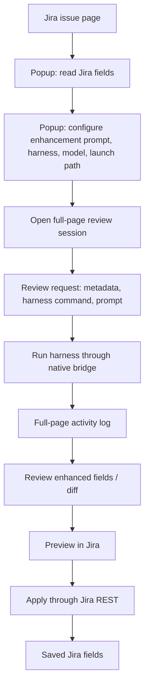
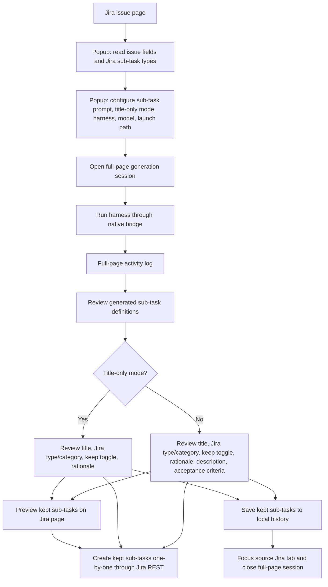

# Jira Enhancer

An AI-powered productivity tool that refines Jira ticket descriptions by contextualising them against your local codebase. It uses a Chrome Extension as the UI layer, a local Node.js bridge for secure OS access, and either **OpenCode** or **Pi CLI** as the agentic LLM engine.

This README is the project overview and setup/development guide. For the full product and technical behavior specification, see [SPECS.md](./SPECS.md). For coding-agent guidance, see [AGENTS.md](./AGENTS.md).

---

## How It Works

The extension reads Jira issue context in the browser, sends structured requests through the native messaging bridge, and runs the selected harness (OpenCode ACP or Pi RPC) against the configured local project path. The bridge communicates with Chrome over **stdin/stdout** using the [Chrome Native Messaging protocol](https://developer.chrome.com/docs/extensions/develop/concepts/native-messaging): every JSON message is prefixed with a 4-byte little-endian length header.

### Issue enhancement flow



### Sub-task generation flow



---

## Prerequisites

| Requirement                                                        | Notes                               |
| ------------------------------------------------------------------ | ----------------------------------- |
| Node.js ≥ 20                                                       | Bridge runtime                      |
| pnpm ≥ 9                                                           | Package manager (`npm i -g pnpm`)   |
| Chrome / Chromium                                                  | Extension host                      |
| [OpenCode](https://opencode.ai) **or** [Pi CLI](https://pi.ai/cli) | Must be installed and authenticated |

---

## Repository Structure

```
jira-enhancer/
├── packages/
│   ├── shared/          # Types, protocol definitions, ADF↔Markdown transformers
│   ├── bridge/          # Native Messaging bridge (Node.js / TypeScript)
│   └── extension/       # Chrome Extension (Manifest V3 / React)
├── plans/               # Design documents
├── turbo.json           # Turborepo pipeline
├── pnpm-workspace.yaml
└── tsconfig.base.json
```

### `packages/shared`

Shared TypeScript interfaces and pure utilities consumed by both the bridge and the extension.

```
src/
├── protocol.ts        # Message schemas (BridgeMessage, ExtensionMessage, enums)
├── jira-types.ts      # AdfDocument, AdfNode, JiraIssue
├── config-types.ts    # BridgeConfig, ProjectMapping
├── errors.ts          # ErrorCode enum, BridgeError class
├── adf-to-markdown.ts # Recursive ADF → Markdown renderer (no external deps)
└── markdown-to-adf.ts # Line-by-line Markdown → ADF parser (no external deps)
```

### `packages/bridge`

Standalone Node.js process registered as a [Native Messaging Host](https://developer.chrome.com/docs/extensions/develop/concepts/native-messaging#native-messaging-host).

```
src/
├── index.ts             # Entry point, message loop, signal handlers
├── message-protocol.ts  # NativeMessagingProtocol (async stream framing, 1 MB limit)
├── config-manager.ts    # Load & validate config.json, project path resolution
├── request-handler.ts   # Dispatch EnhanceRequest → LLM adapter → response
├── process-manager.ts   # Spawn LLM CLI, capture output, enforce timeouts, cleanup
└── llm/
    ├── opencode-adapter.ts  # OpenCode ACP mode (pipe JSON to stdin)
    ├── pi-adapter.ts        # Pi RPC mode
    └── index.ts             # createAdapter() factory
config/
├── config.example.json          # Template for user config
├── native-host-manifest.linux.json
├── native-host-manifest.macos.json
└── native-host-manifest.windows.json
```

Root-level helper scripts:

```text
scripts/
├── install-unix.sh        # Builds extension and installs native messaging host on Linux/macOS
└── install-windows.ps1    # Builds extension and installs native messaging host on Windows
```

### `packages/extension`

Chrome Extension built with Vite + React.

```
src/
├── background/
│   ├── background.ts          # Service worker: routes messages to native host
│   └── native-messaging.ts    # NativeMessagingClient wrapper (auto-connect, routing)
├── content/
│   ├── inject.ts              # Content script entry (MutationObserver for SPA nav)
│   ├── dom-injection.ts       # injectEnhanceButton(), updateButtonState()
│   └── jira-detector.ts       # detectIssueKey() from URL
└── popup/
    ├── popup.tsx              # Root component (enhance → diff → edit flow)
    ├── components/
    │   ├── EnhancePanel.tsx   # Mode selector, provider picker, trigger button
    │   ├── DiffView.tsx       # Side-by-side diff (react-diff-viewer-continued)
    │   ├── MarkdownEditor.tsx # Editable buffer for the refined description
    │   └── LoadingState.tsx   # Spinner + status text + optional progress bar
    └── hooks/
        ├── useNativeMessaging.ts  # Chrome messaging bridge hook
        └── useRefinement.ts       # Refinement state machine hook
```

---

## Installation

### 1. Install dependencies

```bash
pnpm install
```

### 2. Build all packages

```bash
pnpm build
```

### 3. Configure the bridge

Copy the example config:

```bash
cp packages/bridge/config/config.example.json packages/bridge/config.json
```

Edit `packages/bridge/config.json` to map your Jira project keys to local repo paths:

```json
{
  "mappings": {
    "PROJ": "/home/you/repos/my-project",
    "WEB": "/home/you/repos/frontend"
  },
  "defaultProvider": "opencode",
  "timeout": 120000
}
```

| Field             | Description                                                                      |
| ----------------- | -------------------------------------------------------------------------------- |
| `mappings`        | Object mapping Jira project key prefixes (e.g. `"PROJ"`) to absolute local paths |
| `defaultProvider` | `"opencode"` or `"pi"`                                                           |
| `timeout`         | Max LLM runtime in milliseconds (default 120 000 = 2 minutes)                    |

### 4. Install the native messaging host

Use the root-level installer for your OS. The scripts prompt for allowed extension domains, write `ALLOWED_SITES` to the gitignored `.env` if you choose, build the project, and install the Chrome native messaging host when an extension ID is provided.

Linux/macOS:

```bash
scripts/install-unix.sh
# After loading packages/extension/dist in chrome://extensions and copying its ID:
scripts/install-unix.sh --extension-id <YOUR_EXTENSION_ID>
```

Windows PowerShell:

```powershell
powershell -ExecutionPolicy Bypass -File scripts\install-windows.ps1
# After loading packages\extension\dist in chrome://extensions and copying its ID:
powershell -ExecutionPolicy Bypass -File scripts\install-windows.ps1 -ExtensionId <YOUR_EXTENSION_ID>
```

By default the scripts use `https://*.atlassian.net/*` and `https://*.jira.com/*`. Add private/local Jira domains only when prompted; they stay in your gitignored `.env` and must not be committed. You can also set `VITE_ACCEPTANCE_CRITERIA_IGNORE_PATTERN` in `.env` to a case-insensitive regex for placeholder Acceptance Criteria text that should be treated as empty, for example `THIS IS A TEST|PLEASE DO NOT USE YET`. Set `VITE_IGNORED_MODEL_PROVIDERS` to a comma-separated list such as `openai,google` to hide those provider IDs from provider/model dropdowns.

The scripts:

- Resolve the bridge path to `packages/bridge/dist/index.js` (no system install needed)
- Write the native host manifest for the current user
- On Windows, create a small `.cmd` wrapper under `%LOCALAPPDATA%\JiraEnhancer\NativeMessagingHost` and register it under `HKCU`

| Platform | Manifest directory / registry                                                                                                                                |
| -------- | ------------------------------------------------------------------------------------------------------------------------------------------------------------ |
| Linux    | `~/.config/google-chrome/NativeMessagingHosts/`                                                                                                              |
| macOS    | `~/Library/Application Support/Google/Chrome/NativeMessagingHosts/`                                                                                          |
| Windows  | `HKCU\Software\Google\Chrome\NativeMessagingHosts\com.jira_enhancer.bridge` with the manifest stored under `%LOCALAPPDATA%\JiraEnhancer\NativeMessagingHost` |

> **Re-runs are safe.** Run the script again any time you rebuild the bridge, change allowed domains, or change your extension ID.

### 5. Load the Chrome extension

1. Open `chrome://extensions`
2. Enable **Developer mode**
3. Click **Load unpacked** → select `packages/extension/dist`

---

## AI AGENT: guided local install checklist

When helping a user install the extension, an AI coding agent should follow this sequence:

1. **Protect private data first**
   - Never commit private Jira domains, customer names, issue text, tokens, or local repo paths.
   - Put user-specific Jira domains in the gitignored `.env` via `ALLOWED_SITES`.
   - Put project-key-to-repo mappings in the gitignored `packages/bridge/config.json`.

2. **Collect only the required local inputs**
   - Jira domain patterns to allow, for example `jira.example.com` or `https://*.example.atlassian.net/*`.
   - Jira project key mappings, for example `PROJ -> /absolute/path/to/repo`.
   - Preferred provider: `opencode` or `pi`.

3. **Run the installer once to configure and build**
   - Linux/macOS: `scripts/install-unix.sh`
   - Windows: `powershell -ExecutionPolicy Bypass -File scripts\install-windows.ps1`
   - Accept the default domains unless the user explicitly gives private domains.
   - Save domains to `.env` when the user wants repeatable local builds.

4. **Guide the user through Chrome UI steps**
   - Ask the user to open `chrome://extensions`.
   - Enable **Developer mode**.
   - Load unpacked extension from `packages/extension/dist`.
   - Ask the user to copy the generated extension ID.

5. **Install the native messaging host with the extension ID**
   - Linux/macOS: `scripts/install-unix.sh --extension-id <EXTENSION_ID>`
   - Windows: `powershell -ExecutionPolicy Bypass -File scripts\install-windows.ps1 -ExtensionId <EXTENSION_ID>`

6. **Verify the install**
   - Reload the extension in `chrome://extensions`.
   - Open an allowed Jira issue page.
   - Confirm the popup can reach the native bridge and list/configure providers.
   - If native messaging fails, rerun the installer with the same extension ID and verify `packages/bridge/dist/index.js` exists.

---

## Development

### Commands

| Command             | Description                                              |
| ------------------- | -------------------------------------------------------- |
| `pnpm build`        | Build all packages (respects Turborepo dependency order) |
| `pnpm test`         | Run unit tests with coverage enforcement (Vitest)        |
| `pnpm lint`         | ESLint across all packages                               |
| `pnpm format`       | Prettier write                                           |
| `pnpm format:check` | Prettier check (used in CI)                              |

### Watch mode (extension)

```bash
pnpm --filter @jira-enhancer/extension dev
```

Rebuilds the extension on file changes. Reload the extension in `chrome://extensions` after each rebuild.

### Running only one package

```bash
pnpm --filter @jira-enhancer/bridge test
pnpm --filter @jira-enhancer/shared build
```

### Unit tests

Unit tests run with V8 coverage enabled and enforce at least 90% line, branch, function, and statement coverage for the covered unit-test targets. Run with:

```bash
pnpm test
```

Coverage reports are written to `packages/*/coverage/`.

### E2E tests (Playwright)

E2E tests load the extension as an unpacked extension into a real Chromium instance:

```bash
# Build the extension first
pnpm --filter @jira-enhancer/extension build

# Run Playwright tests in a virtual display (default; no visible browser window)
pnpm test:e2e

# Backup/debug command: run with a visible browser window
pnpm test:e2e:headed
```

The E2E spec currently launches Chromium in headed extension mode, so `pnpm test:e2e` wraps it with `xvfb-run` on Linux to keep it off your screen. Tests live in `packages/extension/__tests__/e2e/`.

---

## Native Messaging Protocol

Messages between the extension and bridge follow the [Chrome Native Messaging framing](https://developer.chrome.com/docs/extensions/develop/concepts/native-messaging#native-messaging-host-protocol):

```
[ 4 bytes: message length (UInt32LE) ][ N bytes: UTF-8 JSON payload ]
```

Maximum message size: **1 MB**.

### Extension → Bridge (`BridgeMessage`)

```typescript
// Refinement request
{
  type: "ENHANCE_REQUEST",
  id: "uuid-v4",
  issueKey: "PROJ-123",
  description: "Markdown text of current description",
  mode: "default" | "custom",
  customPrompt?: "Make it more technical",
  provider: "opencode" | "pi"
}

// Cancel in-flight request
{ type: "CANCEL", id: "uuid-v4" }
```

### Bridge → Extension (`ExtensionMessage`)

```typescript
// Success
{
  type: "ENHANCE_RESPONSE",
  id: "uuid-v4",
  originalDescription: "...",
  refinedDescription: "..."
}

// Status update (streaming progress)
{
  type: "STATUS",
  id: "uuid-v4",
  status: "processing" | "exploring" | "refining" | "complete",
  progress?: 0.65
}

// Error
{
  type: "ERROR",
  id: "uuid-v4",
  code: "PROJECT_NOT_FOUND" | "LLM_TIMEOUT" | "LLM_PROCESS_ERROR" | ...,
  message: "Human-readable description"
}
```

---

## LLM Providers

### OpenCode (default)

The bridge spawns `opencode acp --cwd <projectPath>` and communicates over ACP JSON-RPC via stdio. The bridge initializes ACP, creates a session, optionally sets OpenCode session config options for selected `provider/model` and `mode=plan`, then sends the structured Jira enhancement prompt with `session/prompt`.

OpenCode reports progress through `session/update`; the bridge accumulates assistant message chunks and parses the final structured JSON response.

### Pi CLI

The bridge spawns Pi in RPC mode with the child process working directory set to the selected project path, then sends the structured Jira enhancement prompt. When selected, provider/model values are passed as `--provider` and `--model` flags.

---

## ADF ↔ Markdown

Jira stores descriptions as **Atlassian Document Format (ADF)** — a structured JSON tree. LLMs work in plain text, so the bridge transparently converts:

```
Jira ADF ──[adfToMarkdown]──► Markdown ──[LLM]──► Markdown ──[markdownToAdf]──► Jira ADF
```

Both converters live in `packages/shared` and have **no external dependencies** — they are small, fully-typed recursive implementations.

Supported ADF node types: `doc`, `paragraph`, `text` (with marks: bold, italic, code, link, strikethrough, underline), `heading`, `bulletList`, `orderedList`, `listItem`, `codeBlock`, `blockquote`, `rule`, `hardBreak`, `table`/`tableRow`/`tableHeader`/`tableCell`, `mention`, `inlineCard`, `mediaSingle`, `status`.

---

## Error Reference

| Code                  | Cause                                                  |
| --------------------- | ------------------------------------------------------ |
| `INVALID_MESSAGE`     | Malformed JSON or unknown message type                 |
| `PROJECT_NOT_FOUND`   | Issue key prefix not present in `config.json` mappings |
| `LLM_TIMEOUT`         | LLM process exceeded configured timeout                |
| `LLM_PROCESS_ERROR`   | LLM CLI exited with non-zero code                      |
| `CONFIG_ERROR`        | `config.json` missing, unreadable, or invalid          |
| `ADF_TRANSFORM_ERROR` | ADF parsing or serialisation failed                    |
| `UNKNOWN`             | Unexpected / uncaught exception                        |

---

## Contributing

```bash
# Install
pnpm install

# Develop (watch mode for extension)
pnpm --filter @jira-enhancer/extension dev

# Before committing — lint-staged runs automatically via Husky
pnpm lint && pnpm test
```

TypeScript `strict` mode is enabled in all packages. ESLint enforces `@typescript-eslint/recommended`. Prettier is enforced on all `.ts`, `.tsx`, `.json`, `.yaml`, and `.md` files.
